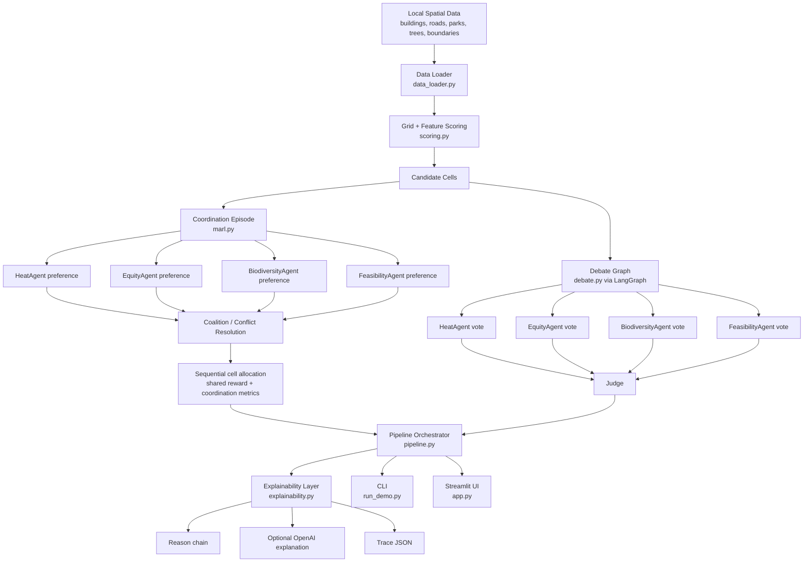

# System Diagram

## Execution Stages

1. `data_loader.py` loads and filters spatial evidence for the chosen area.
2. `scoring.py` converts geometry into candidate grid cells and multi-objective feature scores.
3. `marl.py` runs a sequential coordination episode under a planting budget.
4. `debate.py` runs a LangGraph-based vote and judge pass over top candidates.
5. `pipeline.py` merges coordination and debate outputs.
6. `explainability.py` produces reason chains, optional LLM explanations, and trace outputs.
7. `run_demo.py` and `app.py` expose the system through CLI and UI.
